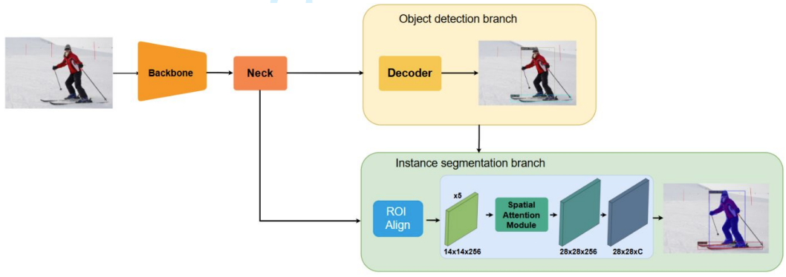
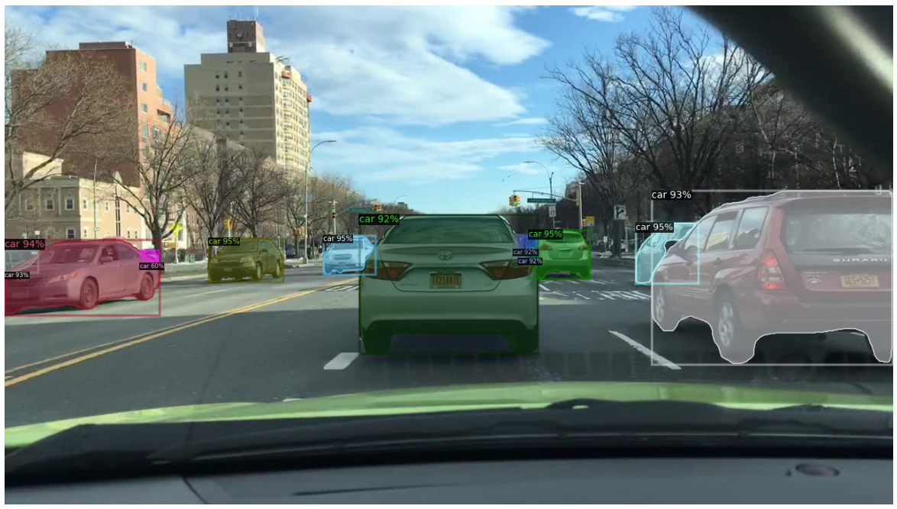
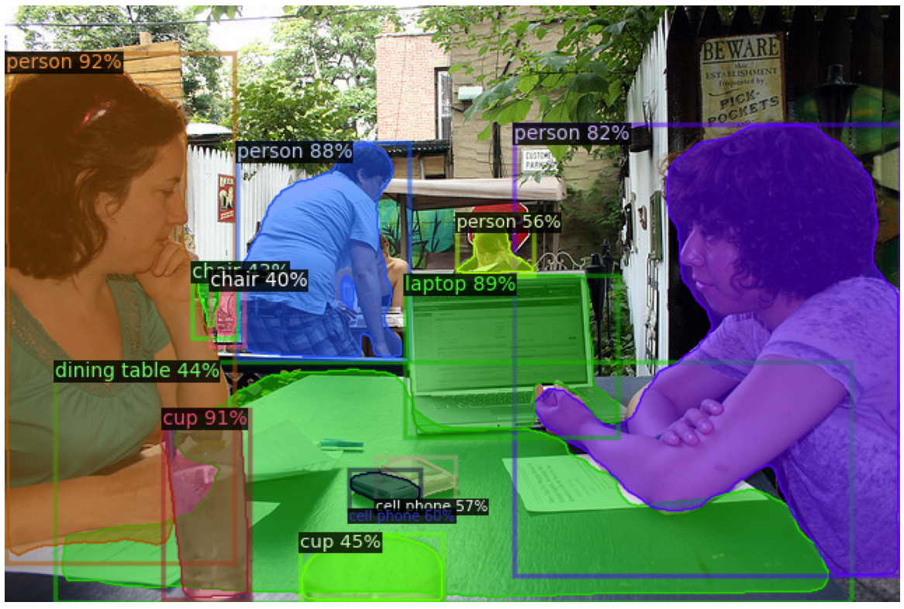

# UniPercepNet-S: : A Lightweight Dual-Task Framework with Attention Mechanisms for Real-Time Object Detection and Instance Segmentation



## Abstract

Object detection and instance segmentation are critical problems in computer vision, particularly in autonomous driving systems, where comprehending the surrounding environment is essential for safe and efficient functioning. Conventionally, distinct tasks necessitate individual models, resulting in extended training durations and considerable computational demands for deployment. To tackle these problems, this study proposes UniPercepNet-S, a lightweight dual-task framework designed for real-time object detection and instance segmentation. Built on a YOLOF-style one-level detector, the model employs a dilated-convolution neck to enlarge receptive fields without relying on feature pyramid network (FPN). We enhance the backbone with a channel attention module based on Squeeze-andExcitation (SE) blocks, which adaptively recalibrate channel-wise feature responses at a slight additional computational cost. Furthermore, object classification and localization tasks are explicitly aligned using a TOOD-style head and assigner, which in turn improves segmentation mask quality. To enable instance segmentation, we attach a simple yet efficient segmentation branch to the one-level detector, forming a unified one-level instance segmentation framework. The segmentation branch predicts a mask for each detected bounding box and incorporates a spatial attention module (SAM) to emphasize informative pixels. Evaluated on MS COCO and BDD100K, UniPercepNet-S achieves 43.6% box AP and 38.0% mask AP on MS COCO with 43 ms/image inference on an RTX A5000 GPU, while maintaining competitive performance on BDD100K with 24.5% box AP and 20.3% mask AP. These results demonstrate an effective accuracy–latency trade-off for unified perception in resource-constrained settings. This research contributes an efficient dual-task framework that supports real-time object detection and instance segmentation, facilitating broader adoption in autonomous vehicle systems.

## Environment

Our models are built upon MMCV and MMDetection frameworks. To use our models, please install the MMCV and MMDetection first. Please refer to the [MMCV installation guide](https://mmcv.readthedocs.io/en/latest/get_started/installation.html) and [MMDetection installation guide](https://mmdetection.readthedocs.io/en/latest/get_started.html#installation) for more details.

Below is our environment configuration used for training and evaluation.

- Python: 3.10
- CUDA Runtime: 12.2
- Pytorch: 2.2.2
- TorchVision: 0.17.2
- OpenCV: 4.7.0
- MMCV: 2.0.0
- MMDetection: 3.3.0

## Experiments and Results

**Ablation study on MS COCO2017 val**

| Backbone | SE Module | SAM Module | Params (M) | FLOPs (G) | Epochs | Box mAP (%) | Mask mAP (%) | 
|:---:|:---:|:---:|:---:|:---:|:---:|:---:|:---:|
| ResNet50 | ✘ | ✘ | 37.5 | 164 | 12 | 33.5 | 29.5 |
| ResNet50 | ✔ | ✘ | 40.0 | 164 | 12 | 34.3 | 30.6 |
| ResNet50 | ✘ | ✔ | 37.5 | 164 | 12 | 33.7 | 30.2 |
| ResNet50 | ✔ | ✔ | 40.0 | 164 | 12 | 34.5 | 30.9 |
| RegNetX_4gf | ✘ | ✘ | 34.4 | 161 | 12 | 37.5 | 33.1 |
| RegNetX_4gf | ✔ | ✘ | 35.4 | 161 | 12 | 39.2 | 34.5 |
| RegNetX_4gf | ✘ | ✔ | 34.4 | 161 | 12 | 37.5 | 33.2 |
| RegNetX_4gf | ✔ | ✔ | 35.4 | 161 | 12 | 39.3 | 34.8 |

**Comparative analysis with existing methods on MS COCO2017 val**

| Model | Epochs | Params (M) | FLOPs (G) | Latency (ms) | Box mAP (%) | Mask mAP (%) |
|:---:|:---:|:---:|:---:|:---:|:---:|:---:|
| Mask_RCNN-R50-FPN | 36 | 44.4 | 250.0 | 51.1 | 40.9 | 37.1 |
| YOLACT-R101-FPN | 55 | 54.3 | 91.7 | 21.2 | 33.1 | 30.4 |
| Mask2Former | 50 | 44.0 | 226.0 | 182.7 | - | 43.7 |
| RTMDet_Ins-R50-FPN | 36 | 35.9 | 295.2 | - | 45.3 | 39.7 |
| YOLOv8s-seg | - | 11.8 | 42.6 | 14.2 | 44.6 | 36.8 |
| UniPercepNet-S | 36 | 35.4 | 161.0 | 43.0 | 43.6 | 38.0 |

**Ablation study on BDD100k val**

| Backbone | SE Module | SAM Module | Params (M) | FLOPs (G) | Epochs | Box mAP (%) | Mask mAP (%) | 
|:---:|:---:|:---:|:---:|:---:|:---:|:---:|:---:|
| ResNet50 | ✘ | ✘ | 37.5 | 164 | 12 | 19.0 | 16.5 |
| ResNet50 | ✔ | ✘ | 40.0 | 164 | 12 | 19.9 | 16.7 |
| ResNet50 | ✘ | ✔ | 37.5 | 164 | 12 | 19.3 | 16.6 |
| ResNet50 | ✔ | ✔ | 40.0 | 164 | 12 | 19.9 | 16.8 |
| RegNetX_4gf | ✘ | ✘ | 34.4 | 161 | 12 | 20.6 | 17.3 |
| RegNetX_4gf | ✔ | ✘ | 35.4 | 161 | 12 | 21.0 | 17.9 |
| RegNetX_4gf | ✘ | ✔ | 34.4 | 161 | 12 | 20.8 | 17.4 |
| RegNetX_4gf | ✔ | ✔ | 35.4 | 161 | 12 | 21.2 | 18.0 |

**Comparative analysis with existing methods on BDD100K val**

| Model | Epochs | Params (M) | FLOPs (G) | Latency (ms) | Box mAP (%) | Mask mAP (%) |
|:---:|:---:|:---:|:---:|:---:|:---:|:---:|
| Mask_RCNN-R50-FPN | 50 | 44.4 | 250.0 | 51.1 | 25.5 | 20.7 |
| Mask2Former | 50 | 44.0 | 226.0 | 182.7 | - | 19.6 |
| YOLOv8s-seg | 36 | 11.8 | 42.6 | 14.2 | 24.7 | 17.5 |
| UniPercepNet-S | 36 | 35.4 | 161.0 | 43.0 | 24.5 | 20.3 |

## Dataset zoo

We expect the datasets' annotations to be in COCO format to train and validate YOLOF-Mask easily. 

We currently support two datasets `BDD100K` and `COCO2017`. Download the datasets and structure the datasets as follows:

Create symlink to `datasets` folder.

```bash
cd UniPercepNet-S
mkdir datasets
ln -s /your/path/to/coco2017/dataset ./datasets
ln -s /your/path/to/bdd100k/dataset ./datasets
```

## Training 

Example of training UniPercepNet-S with SAM and SE modules on COCO2017 dataset with 36 epochs

```bash
cd UniPercepNet-S
export UNIPERCEPNET_DIR=$(pwd)
python3 tools/train.py ./configs/unipercepnet_s_regnetx_4gf_se_sam_3x_coco.py
```

## Evaluation

Example of evaluating UniPercepNet-S with SAM and SE modules on COCO2017 dataset

```bash
cd UniPercepNet-S
export UNIPERCEPNET_DIR=$(pwd)
python3 tools/test.py ./configs/unipercepnet_s_regnetx_4gf_se_sam_3x_coco.py /path/to/model.pth
```

## Inference

To use UniPercepNet-S model, you can predict by Python code.

```python
import mmcv
import mmengine
from mmdet.apis import init_detector, inference_detector
from mmdet.utils import register_all_modules
from mmdet.registry import VISUALIZERS

config_file = './configs/unipercepnet_s_regnetx_4gf_se_sam_3x_coco.py'
ckpt_file = './path/to/model.pth'

# register all modules in mmdet into the registries
register_all_modules()

# build the model from a config file and a checkpoint file
model = init_detector(config_file, checkpoint=ckpt_file, device='cuda:0') 

image = mmcv.imread('./path/to/image.jpg', channel_order='bgr')
result = inference_detector(model, image)

# visualize the results
visualizer = VISUALIZERS.build(model.cfg.visualizer)
visualizer.dataset_meta = model.dataset_meta

visualizer.add_datasample(
    'result',
    image,
    data_sample=result,
    draw_gt = None,
    pred_score_thr=0.3,
    wait_time=0,)
visualizer.show()
```

## Result sample

BDD100K results



COCO2017 result



## Citation

If you find this repository useful for your research, please consider citing the following paper:

```Add later```